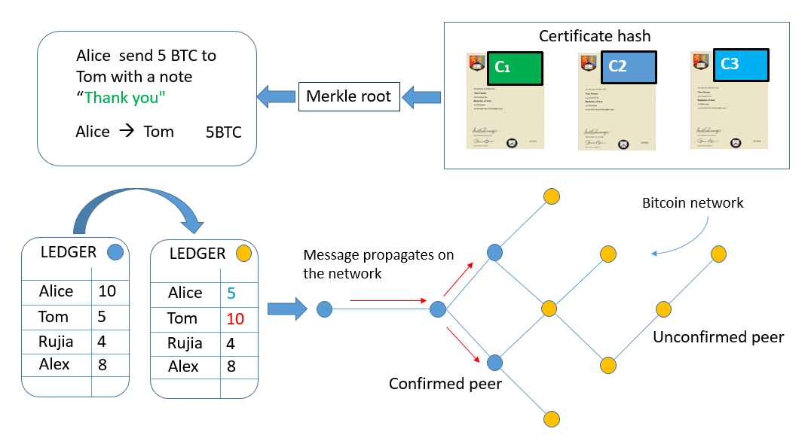
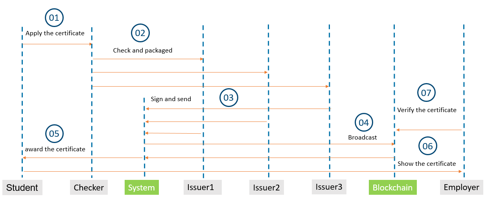

# BC Verifier
BC Verifier authenticates academic certificates by means of a digital receipt that allows immediate verification by third parties. BC Verifier is inspired by the open source project [Blockcerts]. As in Blockcerts, BC Verifier issues a digital credential by sending a Bitcoin transaction from the awarding institution to the recipient/certificate owner. As illustrated in Figure 1, a set of hash value of certificates would be attached to the Bitcoin transaction when Alice paid 5 BTC to Tom. By the design of BC Verifier, Alice replaces the note "thank you" by the Merkle root corresponding a group of certificates. Then, BC Verifier allows an independent verifier to check the authenticity of such certificates by retreiving the hash value from the Bitcoin blockchain and comparing it to the local receipt.


*Figure 1. Working mechanism of BC Verifiers/Blockcerts*

BC Verifier uses additional cryptographic techniques to improve robustness and availability of the credentials issuing operation. BC Verifier uses multiple signatures to improve on the security of digital credentials issuing. BC Verifier adds a revocation mechanism based on BTC address to revoke a certificate more reliably, and establishing a secure federated identity aimed at verifying the awarding institution's identity. The core cryptographic parts of BC Verifier are implemented in JavaScript, which made it possible to handle all the sensitive data on the client side (browser). In other words, BC Verifier never transfers nor stores any sensitive data such as private keys on the server side.

## Prototype workflow
For helping the readers to have a better understanding of BC Verifier, we created a prototype model workflow from four primary roles, including student, checker, issuer, system and employer. The prototype workflow is shown in figure 2 below.

*Figure 2. Workflow of prototype.* 

Firstly, the student applies to the school for a certificate, and the certifiers check the students’ information and merge the certificate with a Bitcoin transaction once it is approved. Then a given threshold of issuing committee members sign it with their private keys. After that, the system broadcasts the transaction which contains the Merkle root of all the certificates. Next, the student receives a JSON-based certificate once the transaction is confirmed and added to the Bitcoin blockchain. In the next stage, the student provides the JSON-based certificate to the verifier (e.g. a company where he or she applies for a job). Lastly, the company verifies the certificate via access to the Blockchain and checks the authentication code to confirm the identity of the school.

## System architecture  
As it is shown in Figure 3, the system consists of four components in our implementation: verification application including federated identity, issuing application involving multi-signature and BTC-address based revocation, Blockchain and local Database adopted by MongoDB.


*Figure 3. System architecture diagram*

The issuing application is responsible for the main business logic, including requesting, examining, signing and issuing of the credential attesting for the existence of an academic certificate. The issuing application is designed to merge the hash of the certificate with a Merkle tree and send the Merkle root to the Bitcoin blockchain. Also, the issuing application deals with the revocations of certificates. The main component functions in the issuing application are:
> +	Login function
> +	Privilege control (RBAC mode)
> +	The approval process (student->>checker->>supervisor->>administration staff->>head of school)
> +	Multi-signature function
> +	Auditing the certificate
> +	View the published certificate
> +	View the signed certificate
> +	View the certificate ready to sign
> +	Revoking the certificate batchly
> +	Administration page to manage the user, the privilege and certificate.
> +	Cold storage for the keys (will release in next version)

The verification application focuses on checking the authenticity and integrity of the certificates that have been issued. It includes two main components: a web-based page and an Android-based application. They use the same mechanism: fetching the transaction message through the blockchain API and comparing the transaction message to the verification data from the digital receipt. The mechanism can be briefly described in the following way: checking the authentication code; checking the hash with the local certificate; confirming the hash in the Merkle tree; examining the Merkle root in the blockchain; verifying the certificate has not been revoked; validating the expired date of the certificate. Also, for the convenience of sharing the certificates, the Android-based application allows the verification by scanning the QR code directly. The main component functions for verification application are the following:
>+ Upload the PDF/JSON files / Scan the QR code
>+ Calculate the hash value for the PDF file 
>+ The interaction with blockchain API 
>+ Authentication management: the issuing address relationship with the school identity.
>+ The logic of the verification:
>> The verification of hash value on the certificate  (to avoid tampering)  
>> The verification to confirm if the hash value is in the merkle tree  
>> The verification to confirm if the hash value of the merkle tree root is on the blockchain  
>> The verification of the validity of the certificate (to avoid the revoked certificate)  
>> The verification of the valid date of the certificate (to avoid the expired certificate)  

The blockchain acts as the infrastructure of trust and a distributed database for saving the authentication data. Typically, the authentication data consists of the Merkle root generated using hashed data from several dozens of certificates. The MongoDB is employed as our local database since the MongoDB can successfully manage JSON-based certificates while providing high availability and scalability.

## System security analysis
**Network security**  
Currently, it's dangerous to open server for receiving the internet request directly, so most companies buffer their contact with the outside world by employing a DMZ. The DMZ create a security gap between intranet and internet. Ideally, to access internal resources, every request has to go through this DMZ. However, even DMZ has the most stringent rules, there is still the probability that hacker from the outside still can access the internal side. In our project, our core database and issuing service run on the internal network that is an envelope environment, in other words, our deployed environment is physically isolated from the outside. A hacker from the outside has no possibility of accessing the internal side except for physical intrusion. This is much more secure than traditional service running inside a DMZ.

*Figure 4. System architecture diagram*

**Data security**  
The database has been designed to contain two categories of data: the public authentication data and the private certificate data. The public authentication data is available to the public and released to the blockchain; the private certificate data is stored in the MongoDB where it is securely protected and isolated in the intranet.

*Figure 5. top level data flow diagram *
Figure 5 maps out the high-level data flow diagram. It shows that the data flow is unidirectional from the internal areas to the internet. The issuing system reads the certificate from the MongoDB and broadcasts its "point" data to the blockchain. The verification service only needs access to the blockchain to check the authenticity of the certificate.

## System deployment  
**Code structure :** 
```
├── README.md
├── pom.xml
├── app.log
└── src
    ├── main
    │   ├── java
    │   │   └──  org.bham.BC Verifier
    │   │   		└── config
    │   │           └── controller
    │   │           └── exception
    │   │           └── filter
    │   │           └── model
    │   │           └── persistence
    │   │           └── service
    │   │           └── utils
    │   │           └── StartApplication.java
    │   └── resources
    │       └── config
    │       └── static
    │       └── templates
    │       └── application.properties
    └── test
        └── java
            └──  org.bham.BC Verifier
```

**Project prerequisites:**  
Operating system: Centos 7 x86_64    
JDK: 1.8  
Docker: Docker CE 17.6  
Maven: Maven 3.3  

**Project deploy instruction:**
1. Install the running environment.  
2. Import the code from repository  
3. Switch to directory  
4. Start the project without Docker  
>Cd /BC Verifier  
> mvn package && java -jar target/Boot-0.0.1-SNAPSHOT.jar  
> nohup java -jar target/Boot-0.0.1-SNAPSHOT.jar &  
5. Start the project with Docker  
> mvn package docker:build  
> docker images  
> docker run image_name:tag_name  
